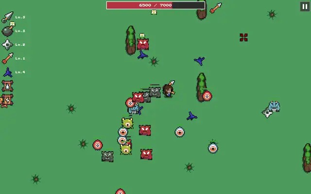

# Mobhold

## Game Description

A fast-paced survival game where you battle endless waves of monsters and survive as long as possible! Each run gets harder as enemy types multiply and difficulty scales!

## How to Play

Use WASD or arrow keys to move your character. Avoid obstacles, collect power-ups, and survive the onslaught. Kill enemies to earn XP and level up your weapons. Survive as long as possible to get a high score!

Tech Stack: HTML5 Canvas + vanilla JavaScript

# 🏆 Credits

Assets: Ninja Adventure Asset Pack by pixel-boy (CC0 - free for any use, attribution appreciated!)

Cursors: https://wenrexa.itch.io/cursors-pack-03

Character and background: https://game-endeavor.itch.io/mystic-woods

Pixel art: https://bigwander.itch.io/

Ice: https://nyknck.itch.io/ice-shard

Flame: https://ikoiku.itch.io/16-x-16-pixel-art-character-flame

Heart: https://lil-cthulhu.itch.io/heart-fullempty

# 📄 License
MIT License - See LICENSE for details.

# 🤝 Contribute

Found a bug? Open an issue.
Want to add features? Fork and PR!
Star the repo to show support. ⭐